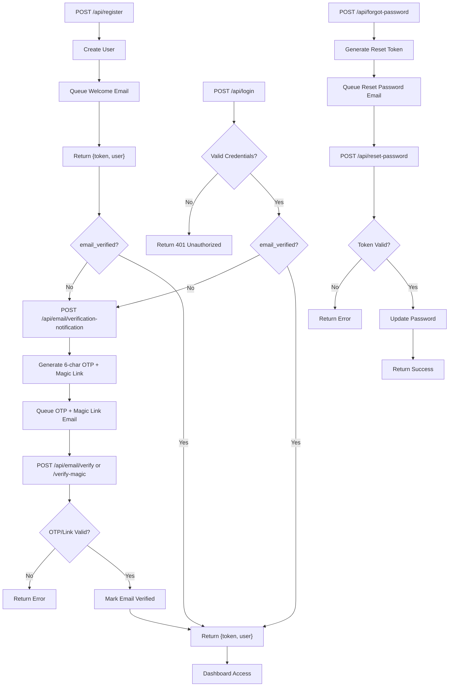

# API - Client Project Tracker

Backend REST API for the Client Project Tracker. Built with **Laravel 13** (PHP 8.4), using **Sanctum** for token-based authentication and **Pest** for testing.

## Tech Stack

- **Laravel** 13
- **PHP** 8.4
- **Sanctum** personal-access tokens (Bearer auth)
- **Pest** PHP unit testing
- **SQLite** (development)
- **PostgreSQL** or **MySQL** (production)

## Requirements

- PHP 8.4+
- Composer
- SQLite, PostgreSQL, or MySQL

## Environment Variables

Copy `.env.example` to `.env` and adjust values before running:

```bash
cp .env.example .env
```

| Variable | Purpose | Example / Default |
| -------- | ------- | ----------------- |
| `APP_URL` | API origin (used in generated links) | `http://localhost:8000` |
| `FRONTEND_URL` | Frontend origin for CORS & email links | `http://localhost:3000` |
| `CORS_ALLOWED_ORIGINS` | Allowed CORS origins (comma-separated) | `http://localhost:3000` |
| `SANCTUM_STATEFUL_DOMAINS` | Stateful domains for cookie auth (if used) | `localhost:3000` |
| `DB_CONNECTION` | Database driver | `sqlite` (dev) / `pgsql` (prod) |
| `DB_DATABASE` | Path to SQLite file or DB name | `database/database.sqlite` |
| `MAIL_MAILER` | Email driver | `log` (dev) / `smtp` (prod) |
| `MAIL_HOST` | SMTP host | `smtp.mailgun.org` |
| `MAIL_PORT` | SMTP port | `587` |
| `MAIL_USERNAME` | SMTP username | |
| `MAIL_PASSWORD` | SMTP password | |
| `MAIL_ENCRYPTION` | SMTP encryption | `tls` |
| `MAIL_FROM_ADDRESS` | From email address | `noreply@example.com` |
| `MAIL_FROM_NAME` | From name | `Client Project Tracker` |
| `QUEUE_CONNECTION` | Queue driver | `database` |

> **Docker overrides:** When using `docker compose`, the `DB_*` values come from your `api/.env` and the `MAIL_*` values are set to Mailpit automatically (see [Email Sending](#email-sending)). These overrides apply only inside the compose stack.

> **Tip:** For local development with a real inbox, use a service like [Mailtrap](https://mailtrap.io/) or [Mailpit](https://github.com/axllent/mailpit) and set `MAIL_MAILER=smtp` with their credentials.

## Local Setup

Single entry point:

```bash
cd api
./start.sh        # Prompts: "Use Docker? [y/N]" → default N (local)
```

### What `start.sh` does

| Choice | Action |
| ------ | ------ |
| **N (default, local)** | Runs migrations, starts `php artisan queue:work` + `php artisan serve` in background. Traps `Ctrl+C` to stop both. |
| **Y (Docker)** | Runs `docker compose up -d --build` inside `.docker/` (or `docker compose up -d --build` from `api/`), waits for healthcheck, prints service URLs. |

> **Note:** `start.sh` internally calls `.docker/up.sh` for the Docker path. You can also run `docker compose up -d --build` directly from the `api/` directory if you prefer.

### Startup URLs

| Mode | API | Health | Mailpit UI | Database |
| ---- | --- | ------ | ---------- | -------- |
| Local | `http://localhost:8000` | `http://localhost:8000/health` | N/A (log) | SQLite file |
| Docker | `http://localhost:8081` | `http://localhost:8081/health` | `http://localhost:8025` | PostgreSQL `localhost:5432` |

Stop local: `Ctrl+C` — stops both server and queue worker.  
Stop Docker: `docker compose down`

## Email Sending

All notifications are **queued** and require a running queue worker:

| Notification | Trigger |
| ------------ | ------- |
| `VerifyEmailNotification` | User requests email verification (OTP + magic link) |
| `WelcomeNotification` | New user registers |
| `ResetPasswordNotification` | User requests password reset |

**`start.sh` automatically starts `queue:work` in the background** — you don't need to run it separately.

### Local (default)
- `MAIL_MAILER=log` (set in `.env`)
- Emails written to `storage/logs/laravel.log`
- Check the log file to inspect sent emails

### Docker
- Mailpit runs automatically as a sidecar service
- **Web UI:** `http://localhost:8025` — view all caught emails (HTML/text preview, headers, raw source)
- **SMTP (host):** `localhost:1025` — send test mail from your machine if needed
- The compose file injects these into the `api` service:
```env
MAIL_MAILER=smtp
MAIL_HOST=mailpit
MAIL_PORT=1025
MAIL_USERNAME=null
MAIL_PASSWORD=null
MAIL_ENCRYPTION=null
```

## Auth Flow



### Step-by-step

1. **Register** — `POST /api/register` creates user, queues welcome email, returns `{ token, user }`. New users have `email_verified=false` → enter verification flow.
2. **Login** — `POST /api/login`: validates credentials → returns 401 if invalid. If valid but `email_verified=false` → user requests OTP + magic link via `POST /api/email/verification-notification` (queued). Verify via `POST /api/email/verify` (OTP) or `POST /api/email/verify-magic` (link). Once verified → returns `{ token, user }`.
3. **Verified** → `Dashboard Access` (include `Authorization: Bearer <token>` header for protected routes).
4. **Password reset** — `POST /api/forgot-password` queues reset email. `POST /api/reset-password` with token from email returns success.

## Dummy Data / Seeding

```bash
php artisan migrate:fresh --seed
# Seeds: 1 demo user (demo@example.com / password) + sample projects
```

## Testing

```bash
php artisan test
# or with Pest:
vendor/bin/pest
```

Manual API testing: `api.http` at repo root — open with VS Code REST Client extension.

## API Docs

Full OpenAPI spec available at `../api-spec.yaml`.